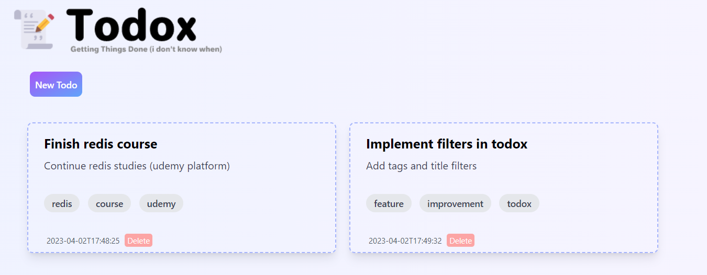

---

Todox its a todo tool to get things done (i don't know when xD)

To start server:

  * Install dependencies with `mix deps.get`
  * Create and migrate your database with `mix ecto.setup`
  * Start Phoenix endpoint with `mix phx.server` or inside IEx with `iex -S mix phx.server`

Now you can visit [`localhost:4000/todos`](http://localhost:4000/todos) from your browser.

## Todo
- [ ] - Add features to readme (fixed)
- [ ] - Release in web and binary format
- [X] - Tags
- [ ] - Notifier (telegram, email)
- [ ] - Task suggest
- [ ] - Platform integration (udemy, coursera)
